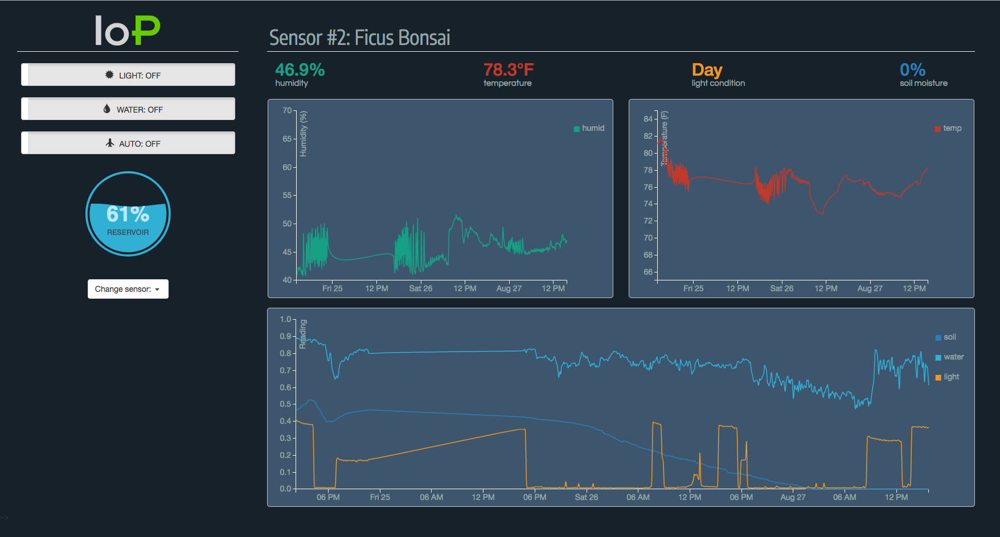

## Internet of Plants I.0
### The purpose of the project is to nurture the connection you have with your plants.

##### This project allows you to remotely water and light your plant anywhere you have an internet connection as well as track the plants temperature, exposure to light, soil humidity, air humidity, and water reservoir.

[Sensor Code Repo](https://noodle-northwestern.herokuapp.com/ "sensor code repository")

##### The repository you are in now contains the code that goes on your server and the link below points to the code we used to upload our plant data to the database from the raspberry pi.

[Sensor Code Repo](https://github.com/tstorti/noodle-sensor "sensor code repository")

